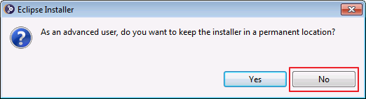
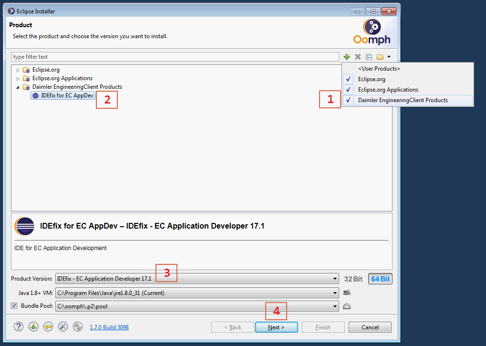
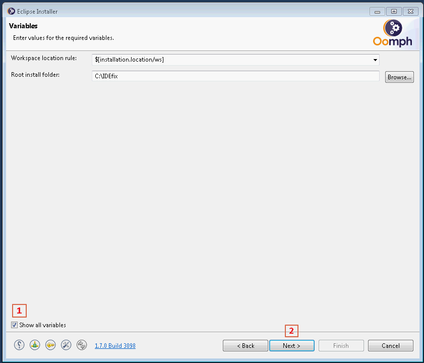
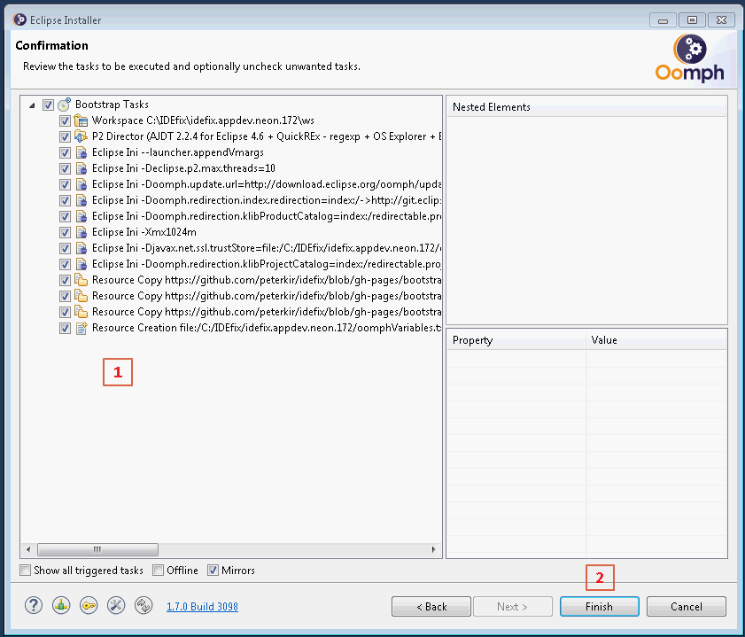
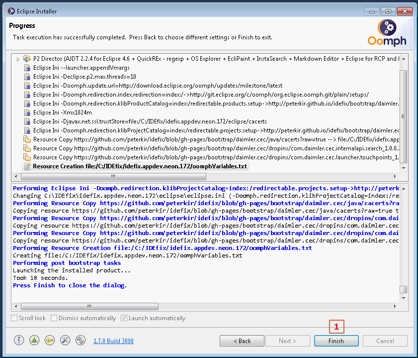
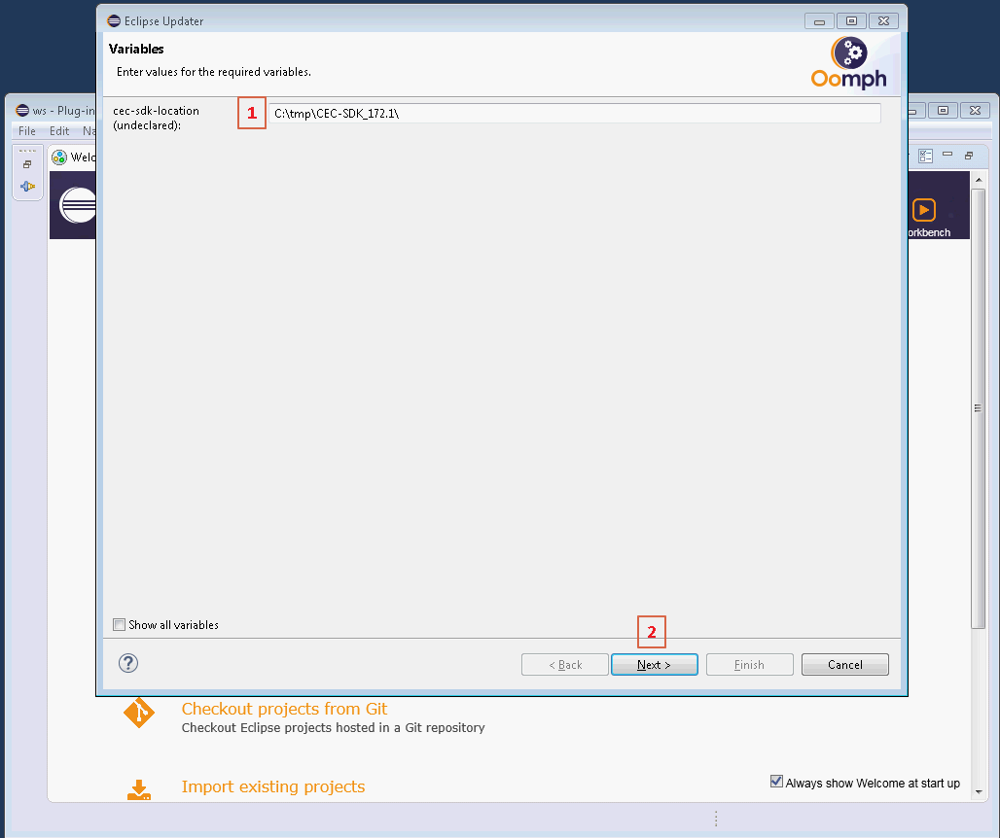
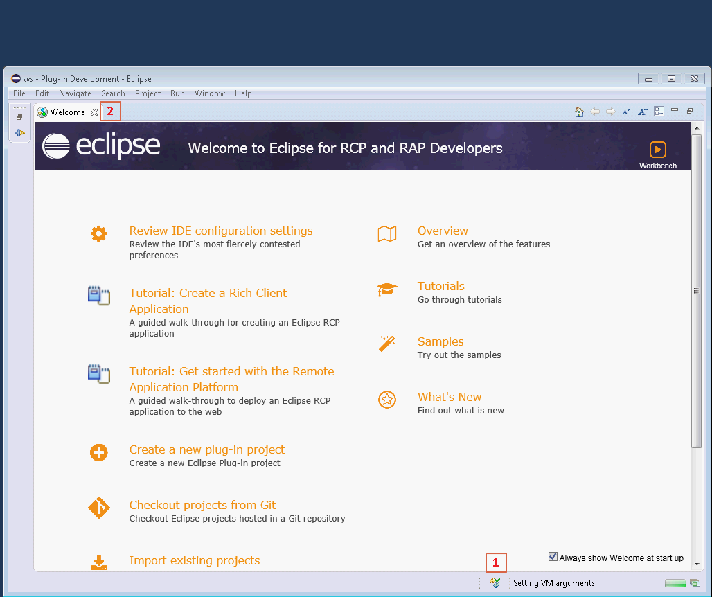
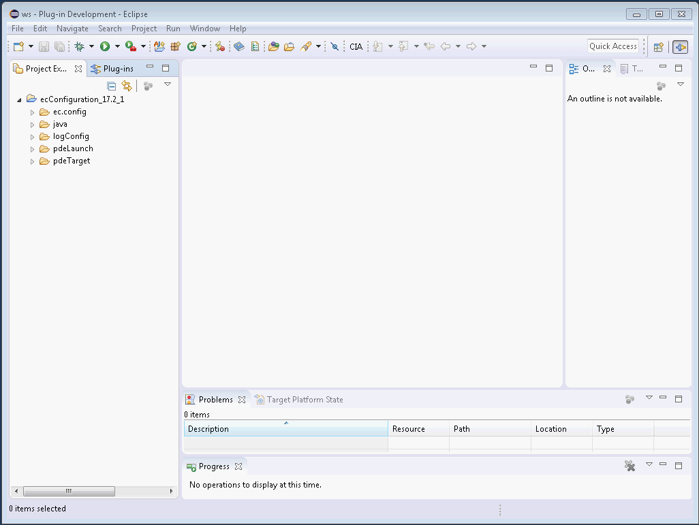

# IDEfix for Application Developer installation

## Pre-requisite

Download/Copy the file eclipse-inst-prod.win32.x86-64.exe locally and launch it.
The file is provided either via

Internet accessible
- [HTTP download](http://klib.io/idefix/20180322-1424/daimler.ec/eclipse-inst-prod.win32.x86-64.exe)

Daimler Network only!!!
- [UNC path - \\\\emea.corpdir.net\EMTC\prj\A-D\CEC-Build\idefix ](file://///emea.corpdir.net/EMTC/prj/A-D/CEC-Build/idefix)
- [HTTP download](https://jazz01.rd.corpintra.net/web/idefix/eclipse-inst-prod.win32.x86-64.exe)

The following steps describe the procedure to install the IDEfix to be ready for application development and/or testing.

### 1. Permanent Location Pop-up

When you are asked for a permanent location select `No`

### 2. Product page - select the IDEfix product version

1. Activate the `Daimler EngineeringClient Products` from the drop-down list
2. Select the Product `IDEfix for EC AppDev`
3. Select the Product Version `IDEfix - EC Application Developer 17.1`
4. Press `Next >`

### 3. Project page - select the CEC project

1. Activate the `Daimler EC Projects` from the drop-down list
2. Select the Project `cec172`
3. Press `Next >`

### 4. Variable page - configure install location

1. Activate the checkbox if you want to change the variables
2. Press `Next >`

### 5. Confirmation page - review and start installation

1. Validate the configured tasks
2. Press `Finish` to start the installation

### 6. Progress page - display the installation progress

1. Press `Finish` after the installation to close the Eclipse Installer

### 7. IDEfix Variable page - configure the CEC-SDK location

1. Enter the location of the extracted CEC-SDK release
2. Press `Next >` to proceed with the configuration of IDEfix

### 8. IDEfix Setup Finished

1. Setup procedure progress is displayed 
2. Close the `Welcome` view

### 9. IDEfix Ready - start app development and/or testing

